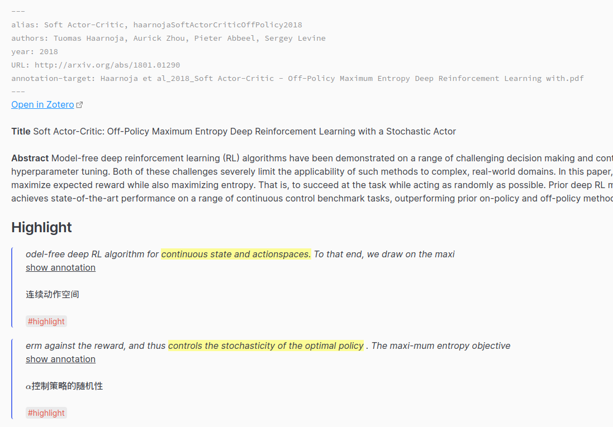

# Obsidian Aggregator

This plugin helps you gather information from files, and make a summary in the file.

Although it is difficult to write the regular expression, once it's done, it will help you a lot.

## Preview

A collection of blocks with a tag.


A collection of annotator blocks with tags.



## Usage

Create a code block like this, and set the language to the `aggregator`. Then this plugin will find content based on RegExp and render the result with the template.

````aggregator
scope:
    - Current File
matches:
    - regex: '>%%\n>```annotation-json\n>.*\n>```\n>%%\n>\*%%PREFIX%%.*\n>%%LINK%%.*\n>%%COMMENT%%\n>.*\n>%%TAGS%%\n>\#[a-zA-Z0-9\_]+\n\^[a-zA-Z0-9]*'
      template: '{{{match.[0]}}}'
````

If you want to sort the results, you can specify the fields and orders like this.

````aggregator
scope:
    - Current File
    - Papers
matches:
    - regex: '^\w[^\#]*\#[a-zA-Z0-9\_]+\s*$'
      template: '{{{match.[0]}}}'
    - regex: '>%%\n>```annotation-json\n>.*\n>```\n>%%\n>\*%%PREFIX%%.*\n>%%LINK%%.*\n>%%COMMENT%%\n>.*\n>%%TAGS%%\n>\#[a-zA-Z0-9\_]+\n\^[a-zA-Z0-9]*'
      template: '{{{match.[0]}}}'
order:
    fields: filename, line
    orders: asc, asc
````

### Argument Explain

Arguments should be written in YAML.

#### scope

**scope:** (list of Regular expressions) Define the search scope, which can be folder name, file name or the file path in the vault. `Current File` is a reserved keyword.

Note: For better performance in a large vault, you should consider using the exact file path instead of a regular expression to avoid searching the whole vault.

#### matches

**matches:** (list of matches)

**match**

-   regex: Regular expression.
-   template: Handlebars template. Available data: `match`, type: `RegExpMatchArray`.

#### order

**order**: (fields and orders) Define the fields you want to sort by and the direction you want, separated by commas. When not present, the plugin will first check the default fields and orders in the setting. If the setting is not valid, the plugin will sort the results by the creating time and the line number.

Valid fields: path, filename, basename, extension, ctime, mtime, match, index, line, ch, template

Valid orders: asc, desc

## Example Usage

### Example 1 Explain

This example shows how to aggregate blocks with tags in the current file.

### Example 2 Explain

This example shows how to aggregate blocks with tags in the current file. The regex is designed for [obsidian-annotator](https://github.com/elias-sundqvist/obsidian-annotator).

## Settings

Note the default join string is not empty. It's just the text area can not display `\n\n`.

`File Indicator` is a Handlebars template. Available data: file: `TFile`, index: number starts at 1.

## See Also

[obsidian-link-embed](https://github.com/Seraphli/obsidian-link-embed)

## Thanks

-   [tag-summary](https://github.com/macrojd/tag-summary)
-   [tracker](https://github.com/pyrochlore/obsidian-tracker)
