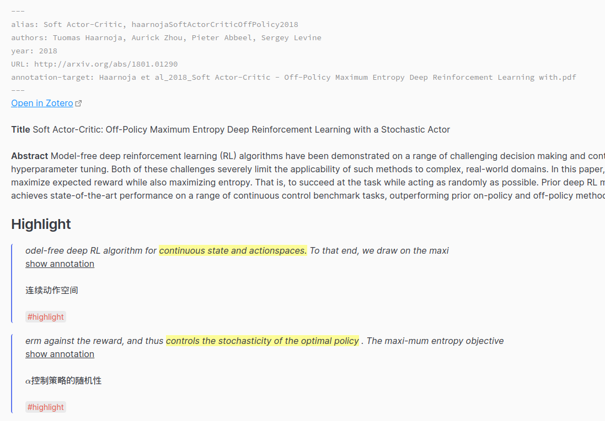
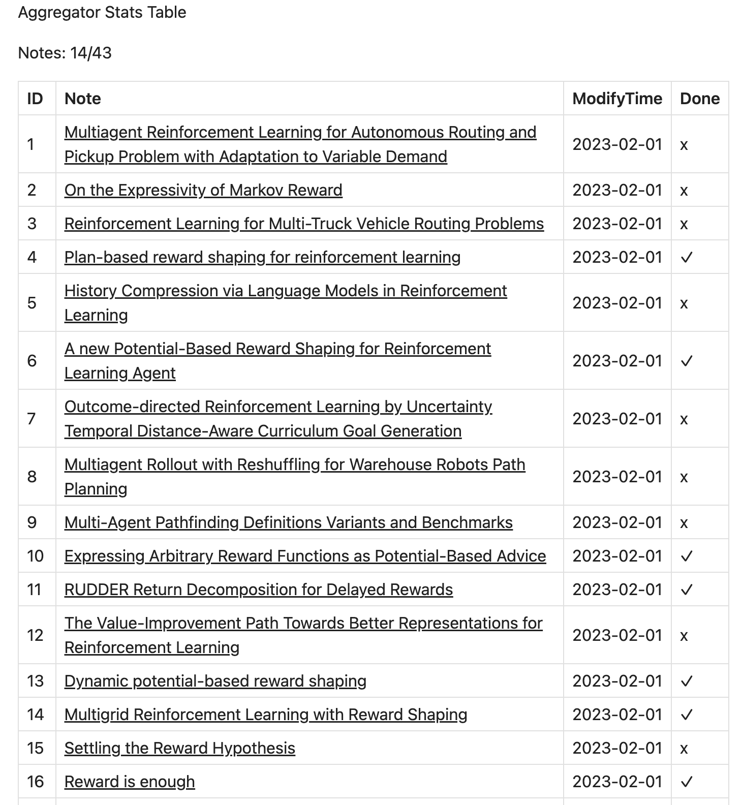

# Obsidian Aggregator

This plugin helps you gather information from files, and make a summary in the file.

Although it is difficult to write the regular expression, once it's done, it will help you a lot.

## Preview

A collection of blocks with a tag. [Example1](docs/Example1.md)


A collection of annotator blocks with tags. [Example2](docs/Example2.md)



A stat table that is generated from a folder with custom helper supported. [Example3](docs/Example3.md)




## Usage

Create a code block like this, and set the language to the `aggregator`. Then this plugin will find content based on RegExp and render the result with the template.

````aggregator
scope:
    - Current File
matches:
    - regex: '>%%\n>```annotation-json\n>.*\n>```\n>%%\n>\*%%PREFIX%%.*\n>%%LINK%%.*\n>%%COMMENT%%\n>.*\n>%%TAGS%%\n>\#[a-zA-Z0-9\_]+\n\^[a-zA-Z0-9]*'
      template: '{{{result.match.[0]}}}'
````

If you want to sort the results, you can specify the fields and orders like this.

````aggregator
scope:
    - Current File
    - Papers
matches:
    - regex: '^\w[^\#]*\#[a-zA-Z0-9\_]+\s*$'
      template: '{{{result.match.[0]}}}'
    - regex: '>%%\n>```annotation-json\n>.*\n>```\n>%%\n>\*%%PREFIX%%.*\n>%%LINK%%.*\n>%%COMMENT%%\n>.*\n>%%TAGS%%\n>\#[a-zA-Z0-9\_]+\n\^[a-zA-Z0-9]*'
      template: '{{{result.match.[0]}}}'
order:
    fields: filename, line
    orders: asc, asc
````

## Argument Explain

Check out [Arguments.md](docs/Arguments.md).

## Example Usage

Check out [docs](docs/) for detailed examples.

## Settings

Note the default join string is not empty. It's just the text area can not display `\n\n`.

`File Indicator` is a Handlebars template. Available data: file: `TFile`, index: number starts at 1.

## See Also

[obsidian-link-embed](https://github.com/Seraphli/obsidian-link-embed)

## Thanks

-   [tag-summary](https://github.com/macrojd/tag-summary)
-   [tracker](https://github.com/pyrochlore/obsidian-tracker)
